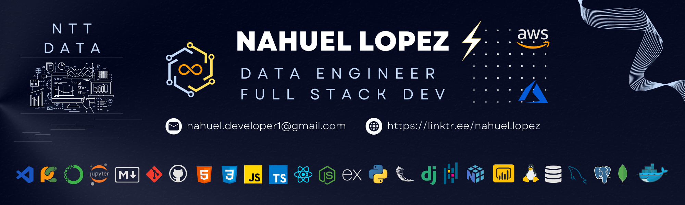

<section align="center">
  <h1><b>Portfolio</b></h1>
  <h2>Data Engineer & Python Developer</h2>
  
  <!-- 
<strong>{Open for hiring}</strong>
 -->
  

  

</section>

## Información:
Este mi portfolio, temporalmente, ya que se encuentra en modificaciones y mejoras.

## Web:

  

## 🛠 Tech Stack:

### Tools:

&nbsp;
&nbsp;
&nbsp;
\
&nbsp;
&nbsp;
&nbsp;
&nbsp;
&nbsp;

### Data Engineering:

&nbsp;
&nbsp;
&nbsp;
\
&nbsp;
&nbsp;
&nbsp;

<!--  -->

### Data Science & Machine Learning:

&nbsp;
&nbsp;
&nbsp;
&nbsp;
&nbsp;
&nbsp;

<!-- &nbsp;
&nbsp; -->

### Databases:

&nbsp;
&nbsp;
&nbsp;
\
&nbsp;
&nbsp;

### Backend:

&nbsp;
&nbsp;
\
&nbsp;
&nbsp;
&nbsp;

### Front-end:

&nbsp;
&nbsp;
\
&nbsp;
&nbsp;

## **Autor**

  
¡Hola, mi nombre es <b><i>Nahuel</i></b> 👋🏽!  

  
Soy de Buenos Aires (Argentina) y me desempeño como Data Engineer en NTT Data, aunque en mi trabajo diario hago tanto ingeniería de datos como ciencia de datos y machine learning.  Amo el mundo de los datos pero también el desarrollo. Actualmente estudio Ingeniería en Sistemas, y en mis momentos libres dedico gran parte de mi tiempo a seguir aprendiendo nuevas tecnologías, como así también a practicar y reforzar mi stack como Ingeniero de Datos.

Si quieres saber más sobre mí, puedes ver mi Portfolio o bien ir a mi perfil de GitHub:

  
💬 Siéntete libre de ponerte en contacto conmigo:

&nbsp;
&nbsp;
&nbsp;

Desarrollado con 💙 por [*Nahuel Dev1⚡*](https://linktr.ee/nahuel.lopez)

---

**************